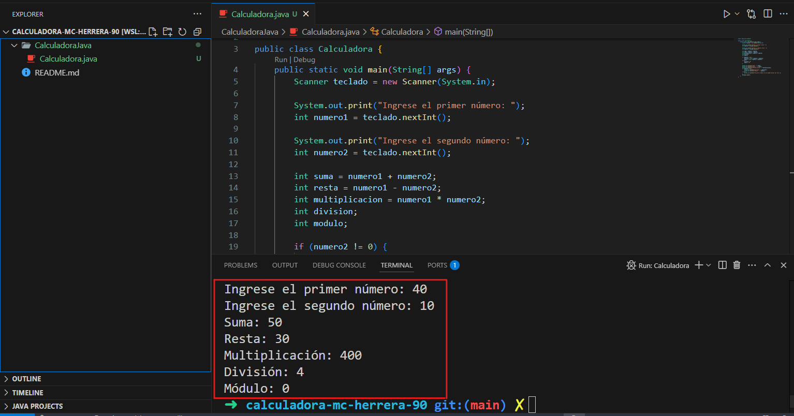

# Screenshot del resultado

# Calculadora
1. **Abrir IntelliJ IDEA:**
    - Abre tu entorno de desarrollo IntelliJ IDEA.
2. **Crear Proyecto:**
    - Crea un nuevo proyecto llamado “CalculadoraJava”.
3. **Crear Clase "Calculator":**
    - Dentro del proyecto, crea una nueva clase llamada **`Calculadora`**.
4. **Implementar Código de la Calculadora:**
    - En la clase **`Calculadora`**, escribe el código para realizar operaciones aritméticas básicas.
    - Declara variables para dos operandos y realiza las siguientes operaciones:
        - Suma.
        - Resta.
        - Multiplicación.
        - División.
        - Módulo (resto de la división).
    - Utiliza nombres de variables significativos.
    - Imprime los resultados de cada operación en la consola.
5. **Características Adicionales:**
    - Permite al usuario ingresar valores para los operandos a través de la consola.
